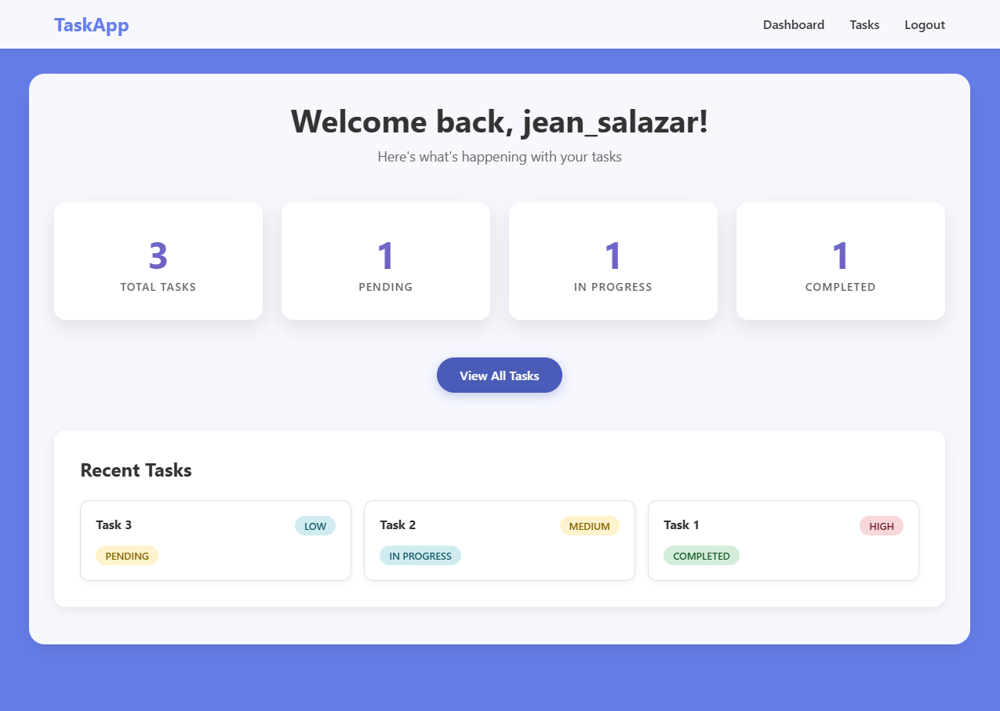
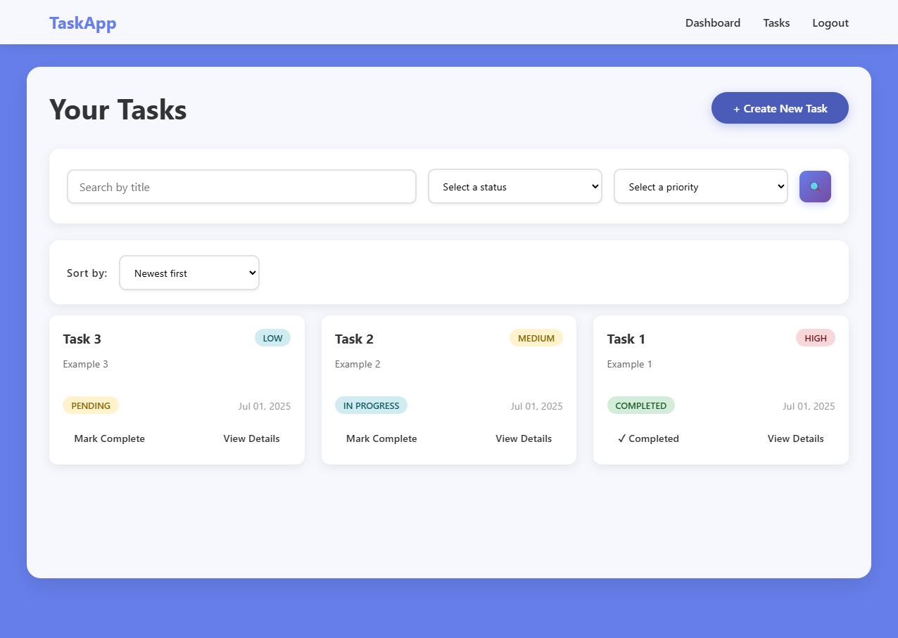
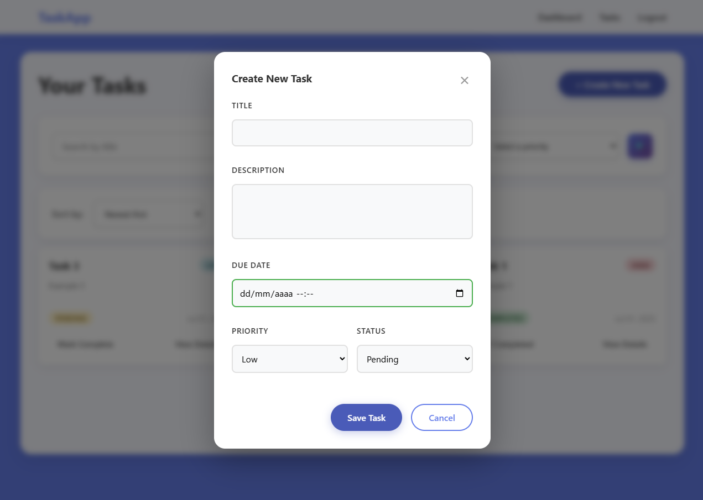

# Task Manager Django

A simple and elegant task management application built with Django.

**Practice Project:** This is a learning project built to practice Django fundamentals including models, views, templates, forms, and deployment.

## Features
- ✅ User authentication (signup/signin/logout)
- ✅ CRUD operations for tasks
- ✅ Task filtering by status and priority
- ✅ Search functionality
- ✅ Pagination
- ✅ Due dates with overdue detection
- ✅ Quick status toggle
- ✅ Responsive design

## Tech Stack
- Django 5.2
- SQLite (development) / PostgreSQL (production)
- HTML5, CSS3, JavaScript
- Deployed on Render

## Installation
1. Clone the repository
2. Create virtual environment: `python -m venv venv`
3. Activate: `source venv/bin/activate` (Linux/Mac) or `venv\Scripts\activate` (Windows)
4. Install dependencies: `pip install -r requirements.txt`
5. Run migrations: `python manage.py migrate`
6. Create superuser: `python manage.py createsuperuser`
7. Run server: `python manage.py runserver`

## Live Demo
[Ver demo en vivo](https://task-management-swmu.onrender.com/dashboard/)

## Screenshots

## Contributing
This project is open to contributions! Whether you're a beginner looking to practice or an experienced developer wanting to help improve the codebase, all contributions are welcome.

## How to contribute:
1. Fork the repository
2. Create a feature branch (git checkout -b feature/amazing-feature)
3. Commit your changes (git commit -m 'Add some amazing feature')
4. Push to the branch (git push origin feature/amazing-feature)
5. Open a Pull Request